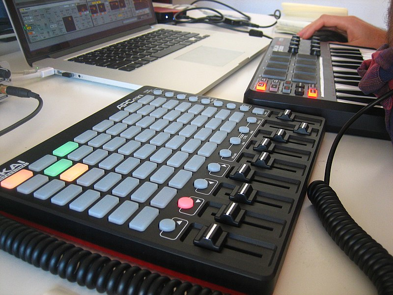

# Using the Akai APC mini to control Sonic Pi 

A collection of utility functions to use the [Akai APC mini](https://www.akaipro.com/apc-mini) MIDI controller with [Sonic Pi](https://sonic-pi.net/).



_Photo credit: <a href="https://commons.wikimedia.org/wiki/File:APC_Mini_and_other_Music_Tools_(15387729761).jpg">I G</a>, <a href="https://creativecommons.org/licenses/by/2.0">CC BY 2.0</a>, via Wikimedia Commons_.

### Important note

This is work in progress and, while it mostly works as described, its performance is not great and it is not completely stable. It can make the controller crash* sometimes when there is _too much_ going on, and even Sonic Pi itself (this is more rare and I have only seen it once, but it's fair to mention).

You should _probably_ not use this yet for live performances, at least without having reproduced similar loads to what you plan to do.

\*I don't know if this crashes happen in the controller itself, or in the software in the computer (be it drivers or Sonic Pi itself), but the way it manifests is: you can still control the sounds using the board, but its lights stop updating. I haven't found a solution to this crashes that is not restarting Sonic PI + plugging and unplugging the controller.

## Installation

[Download](https://github.com/porras/sonic-pi-akai-apc-mini/archive/refs/heads/main.zip), clone the code or install [the gem](https://rubygems.org/gems/sonic-pi-akai-apc-mini), then add this to the top of your Sonic Pi buffer (or your `~/.sonic-pi/config/init.rb`):

```ruby
require '<path-to-sonic-pi-akai-apc-mini>/init.rb'
# for example: require '~/sonic-pi-akai-apc-mini/init.rb'
```

### Finding out where the code is, when installed as a gem

Sonic Pi ships with its own Ruby, meaning that in principle it has no access to the gems installed in your system. To find out where is the file you need to require, run `sonic-pi-akai-apc-mini` in a terminal and the path will be printed.

## Usage

If you want to skip this reference, feel free to load `example.rb` on Sonic Pi and start jamming. Otherwise:

First of all, call `initialize_akai(<model>)` at the top of your buffer. That will make all the features available.

A small set of functions get added to the Sonic Pi API, in order to use the controls in the APC mini in different ways.

### Supported models

* `:apc_mini`
* `:apc_key_25` (experimental; please contact the author if you use it, either successfully or not. in any case, only the grid and the knobs are supported, not the keyboard --yet)

### Faders

#### `fader(n, [target-values])`

This function lets you use any of the faders to control the value of _anything_ in Sonic Pi. `n` is the fader number (starting from 0, left to right). `target-values` is the range of values the fader will map to (and defaults to `0..1`\*). Some examples:

```ruby
play :c4, amp: fader(0)
sample :bd_haus, cutoff: fader(1, 60..127)
```

`target-values` is typically a range, but it can also be an array or a ring. In that case, the range of the fader is divided into discrete regions, each of them mapped to a value:

```ruby
with_fx :slicer, phase: fader(0, [0.125, 0.25, 0.5]) do
  play fader(1, chord(:c4, :major))
end
```

The range can be _upside-down_, if that makes sense for the case. This will play the sound unmodified when the fader is at 0 (127 is the maximum cutoff value), and start cutting off frequencies when the fader is further up.

```ruby
sample :bd_haus, cutoff: fader(0, 127..100)
```

`fader` also accepts the special value `:pan`, which maps to `-1..1`, for that very obvious usecase:

```ruby
play :c4, pan: fader(0, :pan)
```

Finally, it is possible to use the same fader for two different things, with two different target values, if that makes sense for your music:

```ruby
play :c4, amp: fader(0, 0.8..1.5), pan: fader(0, :pan)
```

\*In reality, `0..0.999`. The reason is that there are many parameters with range [0, 1), that is, between 0 and 1 but **not** 1, for example a synth's `res` (resonance). This weird default helps with this case while making no difference for the normal case. If you **really** need to be able to get to 1, then pass `0..1` explicitly.

#### `attach_fader(n, node, property, [target-values])`

All this is fine and good and works great with short synth notes or samples, but sometimes you want to control a sound with a fader _while it is playing_. That's what `attach_fader` is for. Apart from the already known `n` and `target-values`, which work the same, it expects a `node` (a synth node, a sample node, or a fx node) and a `property`, which will be attached to the fader and updated in real-time:

```ruby
with_fx :slicer do |fx|
  attach_fader(0, fx, :mix)
  ... # while these sounds play, you can control how much the slicer can be heard using fader 0
end
```

Or:

```ruby
live_loop :drums do
  drums = sample :loop_amen, beat_stretch: 4
  attach_fader(0, drums, :cutoff, 60..120)
  sleep 4
end
```

`attach_fader` uses `control` under the hood, which means:

* The property needs to be one that can be changed while the sound is playing. Refer to the documentation of each synth and fx.
* It will be affected by the corresponding `_slide` options. It could be said that _it doesn't play very well with any non-zero value in the corresponding `_slide` option_, but in reality pretty cool effects can be created by mixing them.

#### `set_fader(n, [target-values]) { |value| ... }`

There is another variant, lower level, which can be used for anything, but the most typical use case is to connect the fader to some general option like `set_volume!` or `set_mixer_control!`.

```
set_fader(8) { |v| set_volume! v }
```

#### Important notes about faders

1. Because MIDI works with events, it is not possible for Sonic Pi to know the initial position of a fader until it is moved and its new value is sent. Until then, it is assumed it is set to zero. So, two little advices:

* Start your performances with the faders physically set to zero, to match that assumption. Move them to the desired position _before_ evaluating the code that will read them.
* The lights above the faders are used as a hint to avoid this problem: they will be off when Sonic Pi _thinks_ they're set at zero, and on when it _thinks_ they're set at non-zero. If you see a fader physically not at zero but with the light off, move it slightly, so that Sonic Pi learns where it is :)

2. At the moment it is not possible to apply `attach_fader`/`set_fader` to the same fader twice (the second definition _wins_). But you can combine **one** `attach_fader`/`set_fader` with as many `fader` as you want.

### Switches

Each button in the grid can be used as a boolean switch, for any purpose (typically, triggering a sound or not). You could use a fader to map `amp` (and set it to zero when you don't want to hear it), but faders are scarce and there are 64 buttons in the grid :)

#### `switch?(row, col)`

Returns the current value (`true` or `false`) of the specified switch. Columns and rows start from 0, 0 at the lower left corner.

```ruby
live_loop :music do
  sample "some_noisy_sample" if switch?(0, 0)
  ... # some nice music
end
```

The buttons will light green when they're on.

### Selectors

_NOTE: This feature is experimental. It mostly works, but its performance is quite bad and is one of the things that incresases the chance of crashes._

Selectors are a special kind of switches. You can map a series of consecutive buttons in the grid, to different values. Only one of them will be active at the time (lighting green, while the others light red).

#### `selector(row, col, target-values)`

`row` and `col` points to the first button you want to assign, and `values` is an array/ring with the possible values. As many buttons as possible values will be mapped, but the end of the row is a hard limit.

```ruby
live_loop :notes do
  use_synth selector(7, 0, [:fm, :beep, :tb303])
  play scale(:c3, :minor_pentatonic).choose
  sleep 0.5
end
```

Or:

```ruby
play_chord selector(6, 0, [chord(:e3, :minor), chord(:g3, :major), chord(:d3, :major)])
```

As you can see, the use case is very similar to using `fader` with an array, but it is a better UI for many cases. Sadly, it doesn't work perfectly at the moment, so you might prefer to stick with `fader`.

### Triggering sounds

#### `set_trigger(row, col, [options]) { ... }`

You can trigger any code (typically a call to `play` or `sample`, but it can be anything) by pressing a button in the grid using the `set_trigger` function at the top level (outside any live loop). The button will turn yellow (to mark that it can no longer be used as switch), and whenever you press it, the code will be triggered:

```ruby
set_trigger(0, 0) { sample :bd_haus }
```

##### The `release` option

In general, the code will be triggered when you press and there will be no control of the length of the sound: it will play for its whole length (or, apply any envelope options you pass to `play`/`sample`). If you want to control the length of the sound _with_ the button, you can call `set_trigger` with the `release` option. The sound will play for as long you keep pressing the button. When you release it, it will stop the sound in n (the passed number) beats. If you want it to stop immediately, pass `release: 0` (but that won't probably sound very well).

```
set_trigger(0, 0, release: 0.5) do
  use_synth :prophet
  play_chord chord(:c3, :major), sustain: 999 # so that it really lasts until you release
end
```

For the `release` option to work, the block **has** to return a _node_, that's it, it must be a call to `play` or `sample` (or variants like `play_chord`).

#### `reset_trigger(row, col, [options])`

To remove the trigger from the button (and make it available again as switch), you just need to prepend `re` (the signature is the same).

### Looping with the grid

One of the most useful uses of the grid is _looping_. You can set it up so that you can punch notes in the grid, that will be played in loop. This is great (but not only) for drum loops.

#### `loop_rows(duration, rows)`

`duration` is the number of beats the loop lasts. It will always divided by the 8 columns of the grid. `rows` is a hash which maps the row number to a block with the sound to play. For example:

```ruby
live_loop :drums do
  loop_rows(4, {
    7 => -> { sample :drum_heavy_kick },
    6 => -> { sample :drum_snare_hard },
    5 => -> { synth :noise, release: 0.1 } # sketchy hi-hat
  })
end
```

This will assign the top 3 rows of the grid to punch a drum pattern. Notes will be shown as green, and there will be a hinting yellow light showing which column is being played as the loop progresses.

#### `loop_rows_synth(duration, rows, notes, [options])`

A typical use case of looping is calling a synth (always the same) with different notes (e.g. for basslines). This function makes it a bit less verbose:

```ruby
live_loop :bassline do
  loop_rows_synth(8, 0..2, chord(:c2, :minor))
end
```

This will assign each of the three notes of the chord to each row, and now you can punch your baseline.

You can pass options, that will be applied to each note:

```ruby
live_loop :bassline do
  loop_rows_synth(8, 0..2, chord(:c2, :minor), amp: 0.8)
end
```

And, if you need those options to be evaluated separately for each note (because you call random values, or maybe `fader`), you can wrap it in a lambda:

```ruby
live_loop :bassline do
  loop_rows_synth(8, 0..2, chord(:c2, :minor), -> {{ pan: rrand(-1, 1), cutoff: fader(5, 60..120) }}
end
```

Something to note, is that there is no problem to run more than one loop, with different durations, as long as they don't use the same rows.

### Free play

The APC mini is a MIDI device, so you can... play! Be aware that this is of limited usefulness for several reasons (1. there is some latency that is ok for faders and such but makes playing quite difficult, and 2. it is not a keyboard, which makes it _even_ more difficult), but it can be ok for very simple things.

#### `free_play(row, col, synth, notes, [options])`

Assigns a series of consecutive buttons starting at `row`, `col`, to play `notes` with the specified `synth` (and the given `options`, if any). The mapped buttons with light yellow.

```ruby
free_play 0, 0, :fm, scale(:c3, :major), amp: 0.8
```

#### `reset_free_play(row, col, synth, notes, [options])`

If you want to remove a free play mapping (so that the buttons are again available as switches), you need to call `reset_free_play`. It has the same signature so you can just prepend `reset_` to the previous call.

### F.A.Q./"Tricks"

#### Can I use `set_trigger`'s `release` option when I'm triggering more than one sound?

This option assumes 1) that the bock returns immediately 2) that it returns a synth node (because it uses `control` underneath). That said, you can do this (admittedly ugly) trick, so that you fulfill those assumptions even when you're not:

```ruby
set_trigger(0, 0, release: 1) do
  wrap = nil
  with_fx :level do |fx|
    wrap = fx
    in_thread do
      play_pattern_timed chord(:c3, :major).mirror, 0.5
    end
  end
  wrap
end
```

Note the use of `in_thread` so that the block returns immediately even if it started playing a sequence that's going to take 3 beats, and the use of the `level` fx (without parameters, so it will really do nothing) and a variable so that we return the fx node, which is the one that will be silenced when we release the button. Ugly, but works (you can probably define a convenience function if you're going to use this trick often).

### Roadmap of planned features

* A `selector` that actually works
* Free play with samples
* Make it possible to attach/set the same fader more than once
* Better performance and stability in general

## Contributing

Bug reports and pull requests are welcome on GitHub at https://github.com/porras/sonic-pi-akai-apc-mini. This project is intended to be a safe, welcoming space for collaboration, and contributors are expected to adhere to the [code of conduct](https://github.com/porras/sonic-pi-akai-apc-mini/blob/master/CODE_OF_CONDUCT.md).

## License

This code is available as open source under the terms of the [MIT License](https://opensource.org/licenses/MIT).

## Code of Conduct

Everyone interacting in the sonic-pi-akai-apc-mini project's codebases, issue trackers, chat rooms and mailing lists is expected to follow the [code of conduct](https://github.com/porras/sonic-pi-akai-apc-mini/blob/master/CODE_OF_CONDUCT.md).

## Acknowledgments

Apart from the excellent documentation of the Sonic Pi project, [this wonderful summary](https://github.com/TomasHubelbauer/akai-apc-mini) by Tomáš Hübelbauer took me from barely knowing what MIDI is to a functional prototype in a couple of hours. Cheers!
